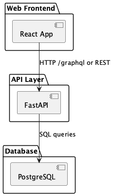
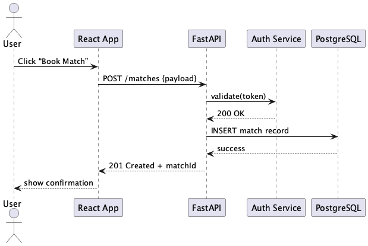

## Development
### Kanban board
https://github.com/orgs/inno-sport-inh/projects/1
### Git workflow
This project follows a structured Git workflow based on **GitHub Flow**, designed to support effective collaboration and high code quality.

---
#### Rules & Conventions
##### Creating Issues
Issues are created using predefined templates.  
See templates in: [`.github/ISSUE_TEMPLATE/`](.github/ISSUE_TEMPLATE/)

##### Labelling Issues
Issues are labelled using the following tags:
- `bug` – For bugs and unexpected behavior
- `enhancement` – New features or improvements
- `question` – General questions or clarifications
- `documentation` – Docs-related tasks
- `help wanted` – Community or team assistance needed

##### Assigning Issues
Issues should be assigned to relevant team members responsible for implementation or resolution.

##### Branching Strategy
Branches are created based on issue types:
- Feature: `feature/<issue-number>-short-description`
- Bugfix: `bugfix/<issue-number>-short-description`
- Hotfix: `hotfix/<issue-number>-short-description`

All work is done in branches and merged into the `main` branch via Pull Requests.

##### Commit Message Format
Commit messages follow the [Conventional Commits](https://www.conventionalcommits.org/) specification:

## Quality characteristics and quality attribute scenarios
https://github.com/inno-sport-inh/backend/blob/main/docs/quality-assurance/quality-attribute-scenarios.md

## Quality assurance
### Automated tests
Unit tests and integration tests was implemented. They can be found [here](https://github.com/inno-sport-inh/backend/tree/main/adminpage/api-v2/tests).

### User acceptance tests
The user acceptance tests can be found [here](https://github.com/inno-sport-inh/backend/blob/main/docs/quality-assurance/user-acceptance-tests.md).

## Build and deployment automation

## Architecture

### Static view

 

We organize our code into three main layers — **React frontend**, **FastAPI backend**, and **PostgreSQL** — each in its own module.
- **Coupling**:
    - Frontend ↔ API: loose coupling via HTTP/REST or GraphQL, so you can swap out backend implementations without touching UI code.
    - API ↔ DB: well-defined repository layer isolates SQL queries, minimizing ripple effects from schema changes.
-  **Cohesion**:
    - Each module has a single responsibility (UI, business logic, data storage), which simplifies both development and testing.
- **Maintainability**:
    - Clear separation of concerns and modular structure make it easy to onboard new developers, write unit tests per component, and refactor services independently.  

### Dynamic view

The above sequence diagram shows what happens when a user books a match:

1. User clicks “Book Match” in the frontend.
2. Frontend sends a POST to FastAPI, which first calls the Auth service to validate the token.
3. Upon success, FastAPI writes a new record to PostgreSQL and returns the created match ID.
4. Frontend confirms booking to the user.

**Measured execution time in production**: _127 ms_ 

### Deployment view

We deploy on AWS using:

-   **CloudFront + S3** for static assets (React bundle).
-   **EKS (Kubernetes)** for both frontend and API pods, behind an ALB with HTTPS termination.
-   **RDS (PostgreSQL)** in a private subnet, with automated backups and Multi-AZ for high availability.

| Component       | Location                   | Notes                          |
| --------------- | -------------------------- | ------------------------------ |
| React app       | S3 + CloudFront CDN        | Globally cached, TTL = 5 min   |
| FastAPI service | EKS (2 pods, 500 m/256 Mi) | Auto-scale on CPU > 60 %       |
| PostgreSQL RDS  | Private subnet, Multi-AZ   | Backups daily, 7-day retention |

This setup lets the customer spin up the entire stack via our Terraform module in their own AWS account—only configuration values (VPC IDs, domain names, secrets) need to be provided.
