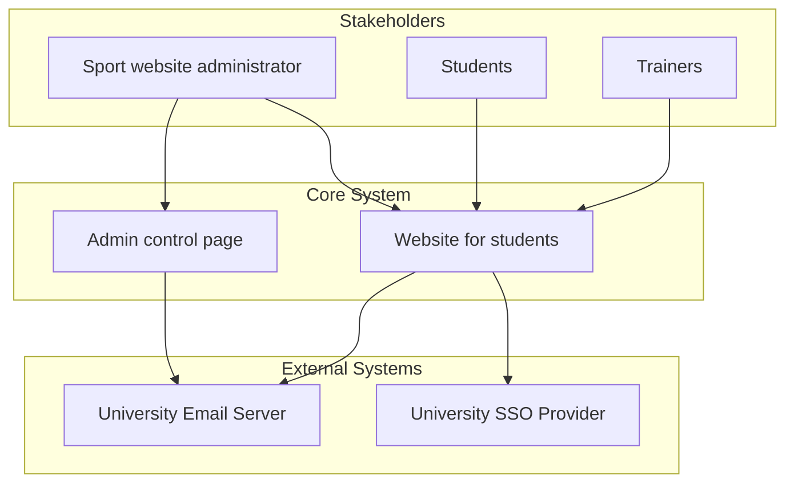
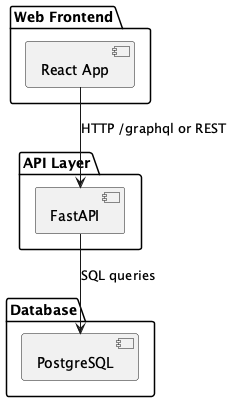
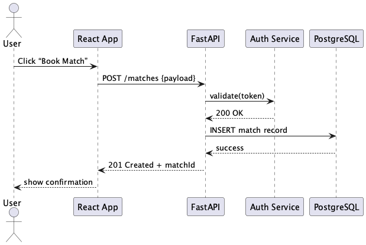
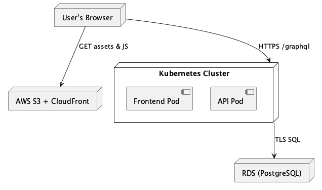

# InnoSport site backend (API-V2)


## Demo video
https://disk.yandex.ru/i/WlsXpBPXi6LQyA

## Current website state preview
https://frontend-prod-eta.vercel.app

---

## Project Goals and Description

This university sports website - **InnoSport** helps students easily check in, explore available sports clubs, and track their completed sport hours.  
It's designed to promote engagement in physical activities through a clean and user-friendly interface.  
Students can stay updated on their progress and discover new ways to stay active.  

**Admin users** have full control over the system, including managing semesters, clubs, trainings, and user data.  
The goal is to streamline sports participation and management in one powerful platform.

## Project Context Diagram

This diagram shows the high-level context of the project, including key stakeholders and external systems interacting with the core application.



## Development

### Kanban board
Kanban board can be found [here](https://github.com/orgs/inno-sport-inh/projects/1).

The table below documents an entry criteria for each column on kanban board.

| **Column**     | **Emtry criteria** |
| -------------- | ------------------ |
| Todo           | The task was planned, but not started |
| In Progress    | The work on the task started, but not completed and doesn't comply DoD |
| Done           | - Code is written and committed to the GitHub<br>- Code is approved by another members (or at least 1)<br>- No critical bugs<br>- Task is moved to the "Done" section in the kanban board<br>- Acceptance criteria is completed |

### Git workflow
TODO

### Secrets management


## Quality assurance

### Quality attribute scenarios
https://github.com/inno-sport-inh/backend/blob/main/docs/quality-assurance/quality-attribute-scenarios.md

### Automated tests
Unit tests and integration tests was implemented. They can be found [here](https://github.com/inno-sport-inh/backend/tree/main/adminpage/api-v2/tests).

### User acceptance tests
The user acceptance tests can be found [here](https://github.com/inno-sport-inh/backend/blob/main/docs/quality-assurance/user-acceptance-tests.md).

## Build and deployment

### Continuous Integration
Our CI pipeline consists of testing and static analysis tools for Python and React.js

#### Workflow files
- https://github.com/inno-sport-inh/backend/blob/main/.github/workflows/tests.yaml
- https://github.com/inno-sport-inh/frontend/blob/main/.github/workflows/node.js.yml

### Github actions pages
- https://github.com/inno-sport-inh/frontend/actions
- https://github.com/inno-sport-inh/backend/actions
  
### Static analysis tools
- Python — [`flake8`](https://github.com/PyCQA/flake8), [`vulture`](https://github.com/jendrikseipp/vulture)
- React.js — [`super-linter`](https://github.com/super-linter/super-linter)

### Testing tools
- Python — [`pytest`](https://github.com/pytest-dev/pytest)
- React.js — [`jest`](https://github.com/jestjs/jest)

## Architecture

### Static view

 

We organize our code into three main layers — **React frontend**, **FastAPI backend**, and **PostgreSQL** — each in its own module.
- **Coupling**:
    - Frontend ↔ API: loose coupling via HTTP/REST or GraphQL, so you can swap out backend implementations without touching UI code.
    - API ↔ DB: well-defined repository layer isolates SQL queries, minimizing ripple effects from schema changes.
-  **Cohesion**:
    - Each module has a single responsibility (UI, business logic, data storage), which simplifies both development and testing.
- **Maintainability**:
    - Clear separation of concerns and modular structure make it easy to onboard new developers, write unit tests per component, and refactor services independently.  

### Dynamic view



The above sequence diagram shows what happens when a user books a match:

1. User clicks “Book Match” in the frontend.
2. Frontend sends a POST to FastAPI, which first calls the Auth service to validate the token.
3. Upon success, FastAPI writes a new record to PostgreSQL and returns the created match ID.
4. Frontend confirms booking to the user.

**Measured execution time in production**: _127 ms_ 

### Deployment view



We deploy on AWS using:

-   **CloudFront + S3** for static assets (React bundle).
-   **EKS (Kubernetes)** for both frontend and API pods, behind an ALB with HTTPS termination.
-   **RDS (PostgreSQL)** in a private subnet, with automated backups and Multi-AZ for high availability.

| Component       | Location                   | Notes                          |
| --------------- | -------------------------- | ------------------------------ |
| React app       | S3 + CloudFront CDN        | Globally cached, TTL = 5 min   |
| FastAPI service | EKS (2 pods, 500 m/256 Mi) | Auto-scale on CPU > 60 %       |
| PostgreSQL RDS  | Private subnet, Multi-AZ   | Backups daily, 7-day retention |

This setup lets the customer spin up the entire stack via our Terraform module in their own AWS account—only configuration values (VPC IDs, domain names, secrets) need to be provided.

## Usage

1. Install [Python 3.12](https://www.python.org/downloads/), [Poetry](https://python-poetry.org/docs/),
   [Docker](https://docs.docker.com/engine/install/)
2. Install project dependencies with [Poetry](https://python-poetry.org/docs/cli/#options-2).
   ```bash
   cd adminpage
   poetry install
   ```
3. Copy environment variables: `cp deploy/.env.example deploy/.env` (leave default values in development)
4. Start services: `docker compose -f ./deploy/docker-compose.yaml up --build`
5. Make migrations and create superuser:
   - Enter shell: `docker compose -f ./deploy/docker-compose.yaml exec -it adminpanel bash`
   - Autocreate migration files: `python3 manage.py makemigrations`
   - Apply migrations to db: `python3 manage.py migrate`
     > If there are problems with migrations applying, try to run the same migrate command with `--fake` option.
   - Create a new superuser: `python3 manage.py createsuperuser`
6. View Admin panel at http://localhost/admin and Swagger at http://localhost/api/swagger

> [!NOTE]
> Server supports auto-reload on code change in debug mode

### Commands

- Dump database
  ```bash
  docker compose -f ./deploy/docker-compose.yaml exec -t db pg_dumpall -c -U user > ./sport_dump.sql
  ```
- Drop database (**dangerous!**)
  ```bash
  docker compose -f ./deploy/docker-compose.yaml down
  # Dangerous!!! - immediately removes all database data
  docker volume rm sport_db-data
  ```
- Setup database from dump and apply migrations
  ```bash
  sh scripts/setup_sport_database.sh ./sport_dump.sql
  ```


