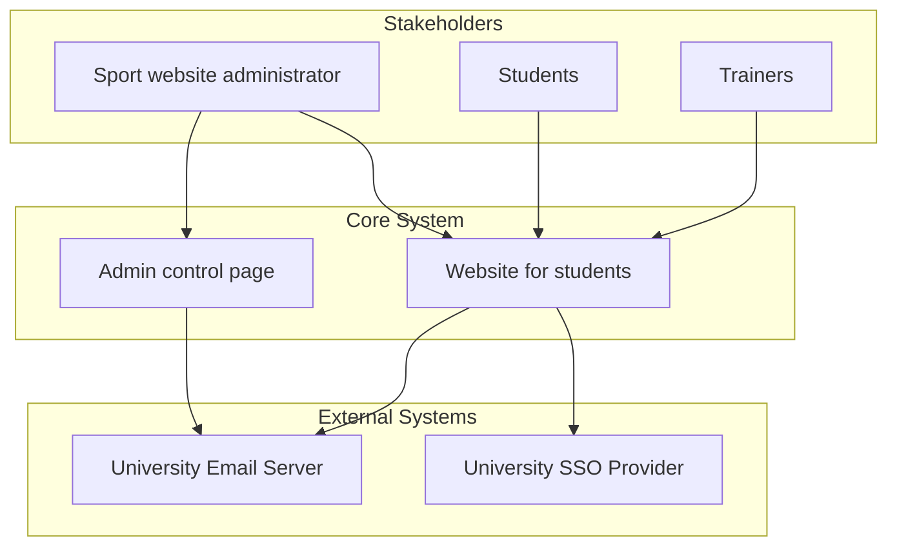

 

  

  <h1 align="center">InnoNoHassle: Sport &ndash; Backend</h1>
  

    

    Backend of the sport page in the InnoNoHassle ecosystem.  
    <a href="https://...">Deployed Product</a>
    &middot;
    <a href="https://...">Demo Video</a>
  

## About The Project
...

### Goals
- ...
- ...

### Roadmap

- [ ] ...
- [ ] ...

### Context diagram

This diagram shows the high-level context of the project, including key stakeholders and external systems interacting with the core application.

## Getting Started

This is an example of how you may give instructions on setting up your project locally. To get a local copy up and running follow these simple example steps.

### Prerequisites
...

### Installation
...

### Usage
...

## Contributing
...

## License
...

