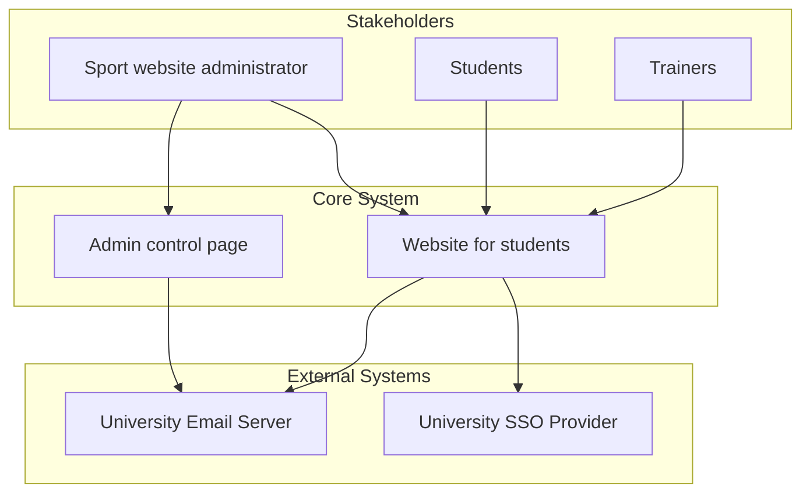

<br />
<div align="center">
  <a href="https://innohassle.ru">
    
  </a>

  <h1 align="center">InnoNoHassle: Sport &ndash; Backend</h1>
  <p align="center">
    <p align="center">
    Backend of the sport page in the InnoNoHassle ecosystem. <br />
    <a href="https://...">Deployed Product</a>
    &middot;
    <a href="https://...">Demo Video</a>
  </p>
</div>

## About The Project
### Project Goals and Description

This university sports website - **InnoSport** helps students easily check in, explore available sports clubs, and track their completed sport hours.  
It's designed to promote engagement in physical activities through a clean and user-friendly interface.  
Students can stay updated on their progress and discover new ways to stay active.  

**Admin users** have full control over the system, including managing semesters, clubs, trainings, and user data.  
The goal is to streamline sports participation and management in one powerful platform.

### Roadmap

ChatGPT said:
- [ ] Add additional functionality to the frontend

- [ ] Clean up the backend by removing outdated functions

### Context diagram

This diagram shows the high-level context of the project, including key stakeholders and external systems interacting with the core application.



## Getting Started

This is an example of how you may give instructions on setting up your project locally. To get a local copy up and running follow these simple example steps.

### Prerequisites
- [Python 3.12](https://www.python.org/downloads/)
- [Poetry](https://python-poetry.org/docs/)
- [Docker](https://docs.docker.com/engine/install/)

### Installation
1. Install project dependencies with [Poetry](https://python-poetry.org/docs/cli/#options-2).
   ```bash
   cd adminpage
   poetry install
   ```
2. Copy environment variables: `cp deploy/.env.example deploy/.env` (leave default values in development)
3. Start services: `docker compose -f ./deploy/docker-compose.yaml up --build`
4. Make migrations and create superuser:
   - Enter shell: `docker compose -f ./deploy/docker-compose.yaml exec -it adminpanel bash`
   - Autocreate migration files: `python3 manage.py makemigrations`
   - Apply migrations to db: `python3 manage.py migrate`
     > If there are problems with migrations applying, try to run the same migrate command with `--fake` option.
   - Create a new superuser: `python3 manage.py createsuperuser`
5. View Admin panel at http://localhost/admin and Swagger at http://localhost/api/swagger


#### Commands

- Dump database
  ```bash
  docker compose -f ./deploy/docker-compose.yaml exec -t db pg_dumpall -c -U user > ./sport_dump.sql
  ```
- Drop database (**dangerous!**)
  ```bash
  docker compose -f ./deploy/docker-compose.yaml down
  # Dangerous!!! - immediately removes all database data
  docker volume rm sport_db-data
  ```
- Setup database from dump and apply migrations
  ```bash
  sh scripts/setup_sport_database.sh ./sport_dump.sql
  ```

> [!NOTE]
> Server supports auto-reload on code change in debug mode

### Usage

## Contributing
...

## License
...


